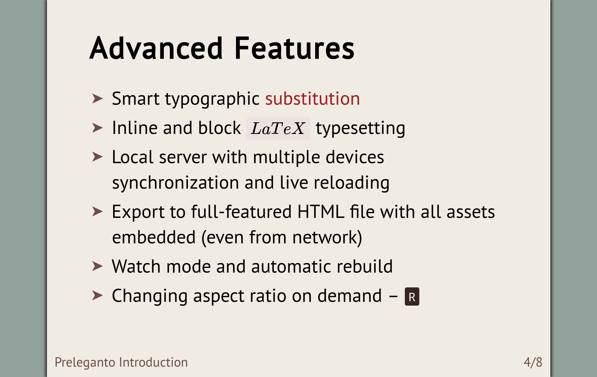

# Preleganto

Preleganto is another in-browser presentation tool which allows you to create
simple yet elegant slides. Just write content in limited subset of AsciiDoc
(very similar to Markdown) and use Preleganto convenient command line interface
to create a beautiful presentation.

## Notable Features

* Convenient "source code to presentation" generation - no manual HTML editing
* Built-in and custom themes and layouts
* Automatic typographic [correction](https://github.com/pnevyk/tipograph) (e.g.,
  "quotes", symbols such as (tm), ...)
* Out-of-the-box support for:
    1. Source code highlighting
    2. LaTeX typesetting



## Usage

1. `npm install -g preleganto`
2. Write some markup into a file (see [examples](examples/) for inspiration)
3. `preleganto build --input presentation.adoc`

## Note

Preleganto is in early stages of development. Many features are missing, no
tests are written, a lot of refactoring is needed and documentation is lacking.
But I hope it will get better over time.

## Contributing

I'd love to see anyone who wants to help, be it a pull request or just a
comment. The source code is written in ES2015 JavaScript with Flow type
annotations.

```
git clone git@github.com:pnevyk/preleganto.git
cd preleganto
npm install
npm run build
node index.js build --input presentation.adoc
```

## Roadmap

See [feature requests](https://github.com/pnevyk/preleganto/labels/feature-request).

## License

Preleganto is licensed under MIT license. Feel free to use it, contribute or
spread the word.
